# Predicción de la Calidad del Agua de los Ríos de la India usando Keras y Apache Spark

> **2do Examen Parcial — Procesamiento de Datos a Gran Escala (28/04/2026)**
> Pontificia Universidad Javeriana — Ingeniería de Sistemas, Octavo Semestre

---

## Índice

1. [Presentación y contexto del proyecto](#1-presentación-y-contexto-del-proyecto)
2. [Tecnologías y entorno de ejecución](#2-tecnologías-y-entorno-de-ejecución)
3. [Descripción del dataset](#3-descripción-del-dataset)
4. [Carga de datos desde Carpeta Compartida del Cluster "/Almacen/"](#4-carga-de-datos-desde-carpeta-compartida-del-cluster-almacen)
5. [Exploración y preparación de datos](#5-exploración-y-preparación-de-datos)
6. [Gráficos y análisis exploratorio](#6-gráficos-y-análisis-exploratorio)
7. [Cálculo del Índice de Calidad del Agua (WQI)](#7-cálculo-del-índice-de-calidad-del-agua-wqi)
8. [Visualización geoespacial sobre el mapa de la India](#8-visualización-geoespacial-sobre-el-mapa-de-la-india)
9. [Modelo de predicción con Keras](#9-modelo-de-predicción-con-keras)
10. [Comparativa y métricas](#10-comparativa-y-métricas)
11. [Análisis de resultados](#11-análisis-de-resultados)
12. [Conclusiones y observaciones](#12-conclusiones-y-observaciones)
13. [Referencias bibliográficas](#13-referencias-bibliográficas)
14. [Estructura del repositorio](#14-estructura-del-repositorio)

---

## 1. Presentación y contexto del proyecto

El presente trabajo busca **predecir el Índice de Calidad del Agua (Water Quality Index — WQI)** de los ríos de la India a partir de mediciones fisicoquímicas y bacteriológicas tomadas por la autoridad ambiental oficial del país (RiverIndia). Se construye un *pipeline* de procesamiento de datos a gran escala apoyado en **Apache Spark** sobre un clúster Hadoop/HDFS, y un **modelo de Deep Learning** implementado en **Keras (TensorFlow)** que aprende a estimar el WQI a partir de los rangos de calidad de cada parámetro.

El flujo metodológico es el siguiente:

```
File (waterquality.csv)
        ↓
Spark Session  →  Limpieza / Casting  →  Análisis estadístico
        ↓
Asignación de Rangos de Calidad (qrPH, qrDO, qrCOND, qrBOD, qrNN, qrFecal)
        ↓
Cálculo del WQI ponderado  →  Etiqueta CALIDAD
        ↓
Visualización (matplotlib + GeoPandas + seaborn)
        ↓
Modelo Keras Sequential (Dense + ReLU + Adam + MSE)
        ↓
Predicción del WQI sobre datos de prueba
```

### Levantamiento de la sesión Spark

La sesión de trabajo se conecta al *Spark Master* del clúster de la Universidad (`spark://10.43.97.177:7077`):

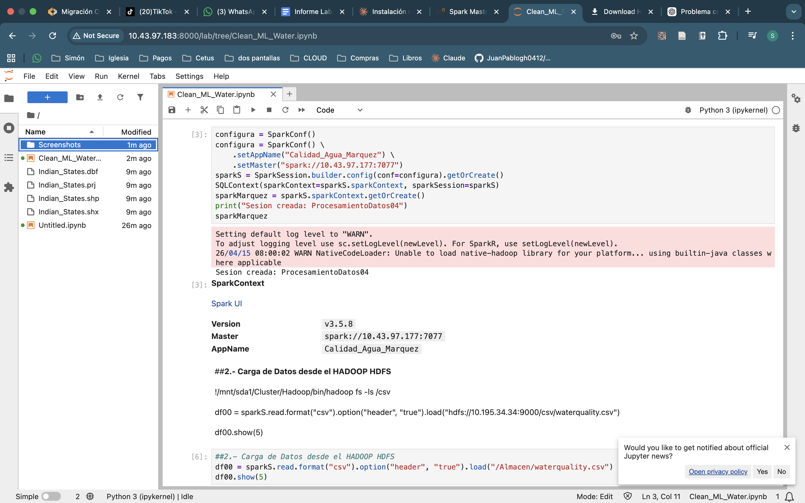

El nombre de la aplicación registrada en el clúster es `Calidad_Agua_Marquez` y la versión utilizada es **Spark 3.5.0**.

---

## 2. Tecnologías y entorno de ejecución

| Componente | Versión / Detalle |
|---|---|
| Lenguaje | Python 3 (kernel ipykernel) |
| Procesamiento distribuido | Apache Spark 3.5.0 (PySpark) |
| Almacenamiento | (`/Almacen/waterquality.csv`) |
| Manipulación de datos | pandas, numpy |
| Visualización | matplotlib, seaborn, pylab |
| Geoespacial | GeoPandas + shapefiles `Indian_States.shp` |
| Etiquetas no superpuestas | `adjustText`, `mapclassify >= 2.4.0` |
| Deep Learning | TensorFlow / **Keras** (`Sequential`, `Dense`) |
| Partición de datos | scikit-learn (`train_test_split`) |

### Bibliotecas importadas

```python
import os, sys
import numpy as np
import pandas as pd
import seaborn as sns
import matplotlib.pyplot as plt
from pylab import *
import findspark; findspark.init()
import pyspark.sql.functions as F
from pyspark import SparkConf, SparkContext
from pyspark.sql import SQLContext, SparkSession
from pyspark.sql.types import *
```

---

## 3. Descripción del dataset

El archivo `waterquality.csv` contiene **534 registros** (uno por estación de medición), donde cada fila corresponde al promedio temporal de las mediciones fisicoquímicas de un punto del río. Las columnas originales son:

| Columna | Descripción | Unidad |
|---|---|---|
| `STATION CODE` | Código único de la estación de medida | — |
| `LOCATIONS` | Nombre del río / ubicación | texto |
| `STATE` | Estado de la India | texto |
| `TEMP` | Temperatura del agua | °C |
| `DO` | Oxígeno disuelto. Más alto ⇒ mejor calidad | mg/L |
| `pH` | Logaritmo negativo de la concentración de H⁺ (acidez) | adimensional |
| `CONDUCTIVITY` | Capacidad de la solución para conducir corriente | µS/cm |
| `BOD` | Demanda Bioquímica de Oxígeno (materia orgánica) | mg/L |
| `NITRATE_N_NITRITE_N` | Nitratos / nitritos. Estimulan crecimiento de algas | mg/L |
| `FECAL_COLIFORM` | Bacterias coliformes (excrementos) | UFC/100 mL |
| `TOTAL_COLIFORM` | **Eliminada** — no aporta a la predicción | — |

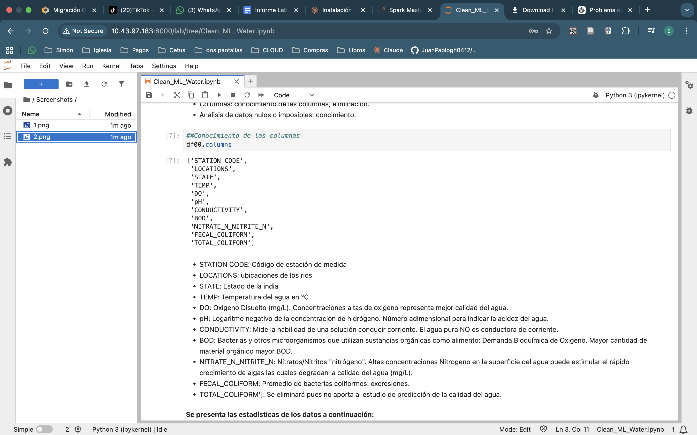

---

## 4. Carga de datos desde Carpeta Compartida del Cluster "/Almacen/"

Los datos se leen directamente desde el clúster con el conector CSV de Spark:

```python
df00 = sparkS.read.format("csv") \
       .option("header", "true") \
       .load("/Almacen/waterquality.csv")
df00.show(5)
```

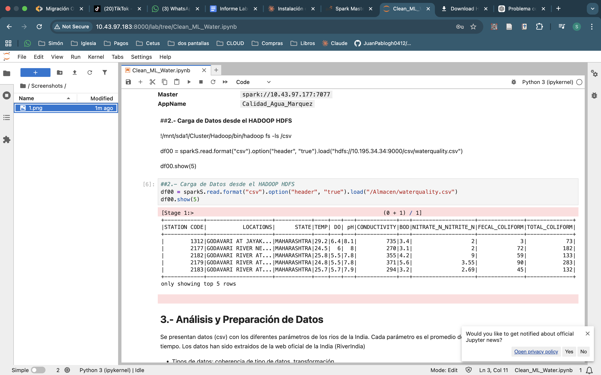

Se observa que todas las columnas se cargan inicialmente como `string`, por lo que será necesario un *casting* posterior a `FloatType` para los parámetros numéricos.

---

## 5. Exploración y preparación de datos

### 5.1 Estadísticas descriptivas (`df00.describe()`)

Iterando por cada columna se obtiene el resumen estadístico del dataset:

```python
for valor in df00.columns:
    df00.describe([valor]).show()
```

| Variable | count | mean | stddev | min | max |
|---|---|---|---|---|---|
| `STATION CODE` | 534 | 2052.51 | 755.22 | 1023 | 41 |
| `TEMP` | 534 | 25.24 | 3.45 | 10.5 | NA |
| `DO` | 534 | 6.39 | 1.62 | 0 | NA |
| `pH` | 534 | 7.79 | 0.65 | 13.2 | 9.1 |
| `CONDUCTIVITY` | 534 | 684.97 | 1769.33 | 100 | NA |
| `BOD` | 534 | 5.34 | 8.50 | 0.2 | NA |
| `NITRATE_N_NITRITE_N` | 534 | 1.38 | 2.08 | 0 | NA |
| `FECAL_COLIFORM` | 534 | 7384.17 | 30714.06 | 0 | NA |
| `TOTAL_COLIFORM` | 534 | 124396.97 | 1458407.81 | 1 | NA |

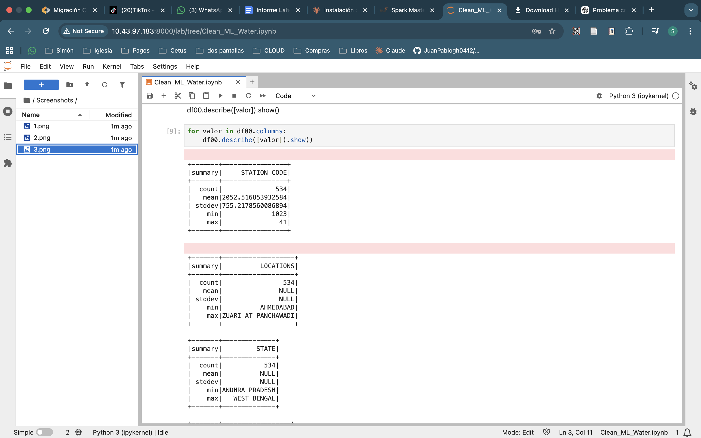
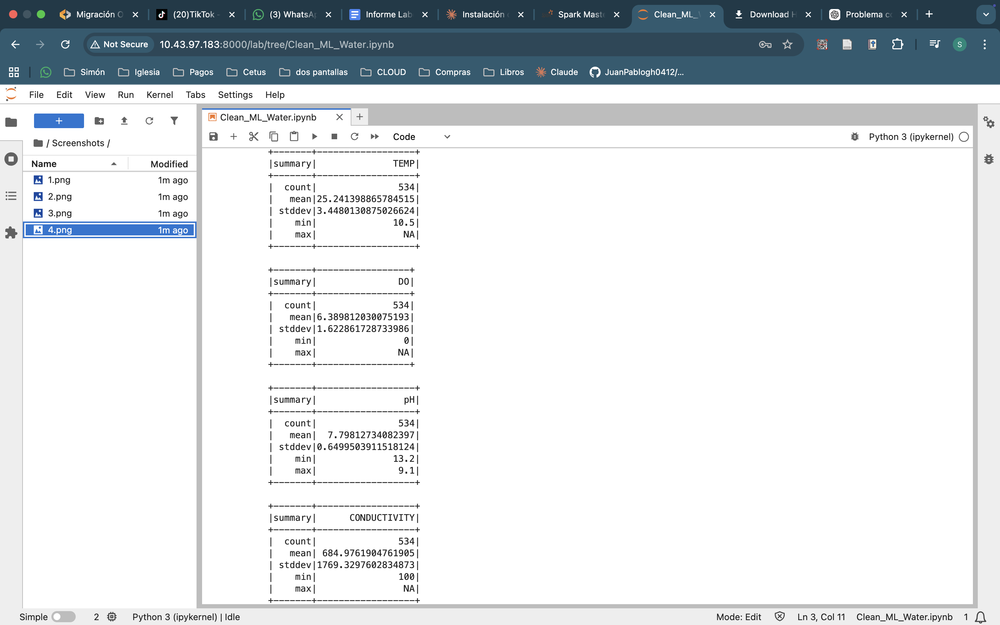
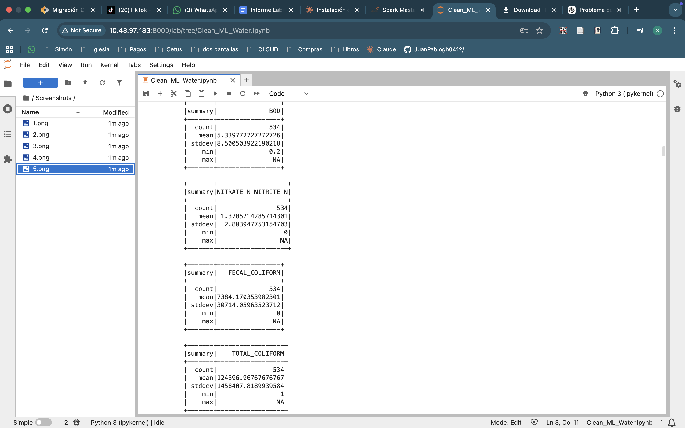

> **Hallazgo importante:** la conductividad y los coliformes fecales presentan **desviaciones estándar enormes** respecto a su media (1769 vs 685 y 30 714 vs 7 384), evidenciando ríos extremadamente contaminados que distorsionan la distribución global y empujarán al modelo a predecir clases de calidad muy heterogéneas.

### 5.2 Inspección de valores nulos / imposibles

```python
df00.select([F.count(F.when(F.isnan(c) | F.col(c).isNull(), c)).alias(c)
             for c in df00.columns]).show()
```

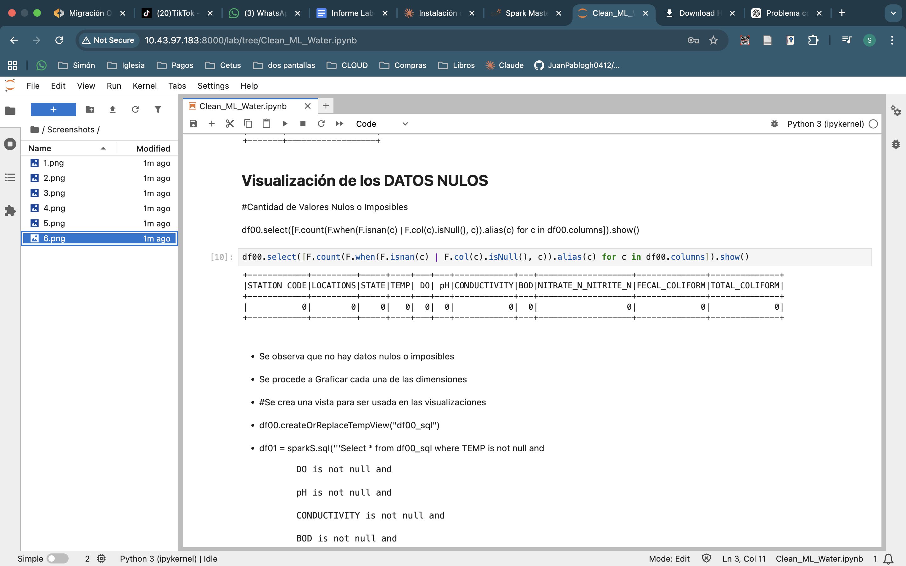

Tras filtrar registros con `null` en cualquier parámetro fisicoquímico, se obtiene `df01` que ya está limpio:

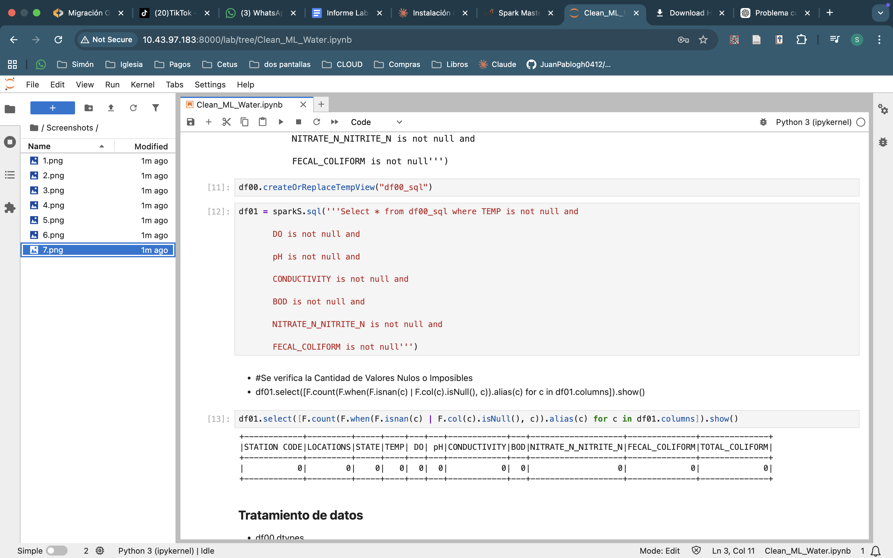

### 5.3 *Casting* de tipos y eliminación de columna inservible

Se convierten los parámetros numéricos a `FloatType` y se elimina `TOTAL_COLIFORM`:

```python
df00 = df00.withColumn('TEMP', df00['TEMP'].cast(FloatType()))
# ... (mismo casting para pH, DO, CONDUCTIVITY, NITRATE_N_NITRITE_N, FECAL_COLIFORM, BOD)
df01 = df00.drop('TOTAL_COLIFORM')
```

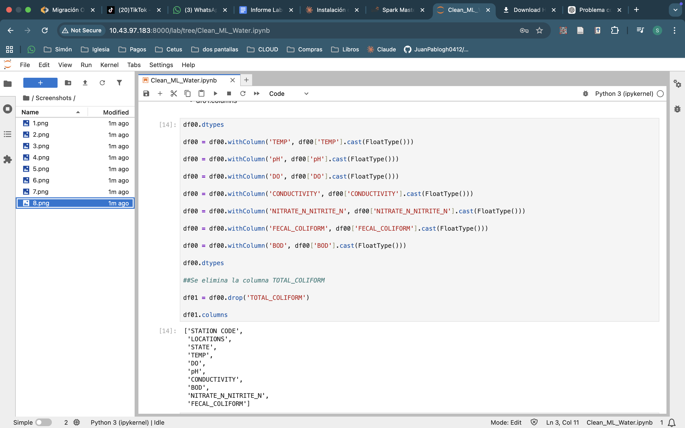

---

## 6. Gráficos y análisis exploratorio

Para visualizar los parámetros se materializan vectores Python con RDDs sobre la vista SQL `df01_sql`:

```python
df01.createOrReplaceTempView("df01_sql")
do_parametro   = sparkS.sql("Select DO from df01_sql").rdd.map(lambda f: f.DO).collect()
ph_parametro   = sparkS.sql("Select pH from df01_sql").rdd.map(lambda f: f.pH).collect()
COND_parametro = sparkS.sql("Select CONDUCTIVITY from df01_sql").rdd.map(lambda f: f.CONDUCTIVITY).collect()
BOD_parametro  = sparkS.sql("Select BOD from df01_sql").rdd.map(lambda f: f.BOD).collect()
NN_parametro   = sparkS.sql("Select NITRATE_N_NITRITE_N from df01_sql").rdd.map(lambda f: f.NITRATE_N_NITRITE_N).collect()
FC_parametro   = sparkS.sql("Select FECAL_COLIFORM from df01_sql").rdd.map(lambda f: f.FECAL_COLIFORM).collect()
```

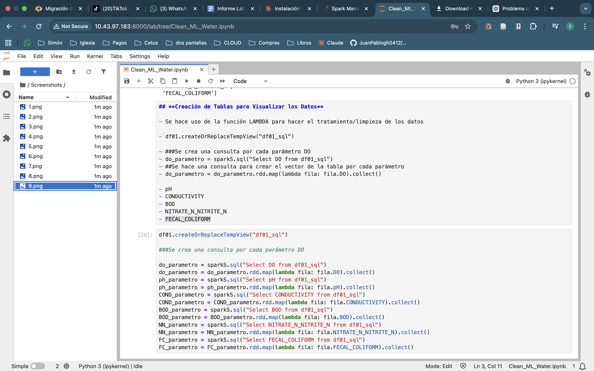

### 6.1 Oxígeno Disuelto (DO) y pH

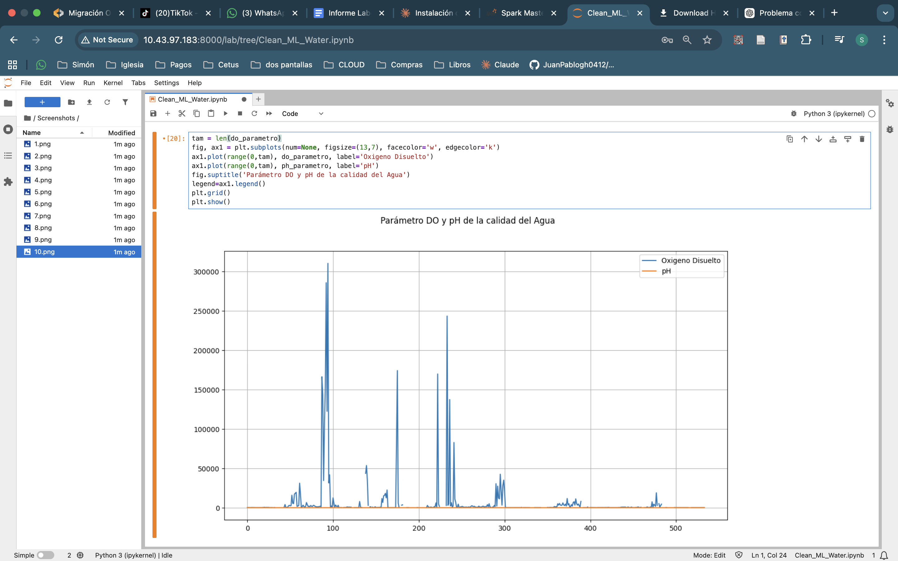

**Observación:** las series de DO y pH se mantienen en una banda baja (0–10 aprox.), pero el escalamiento del eje *y* — dominado por la conductividad cuando se mezcla — hace que el detalle se aplane. Aún así se identifican **picos anómalos** (≈ 100, 200 y 230 en el eje X) que coinciden con estaciones contaminadas. La distribución del pH es muy estrecha (μ = 7.79, σ = 0.65), lo que indica que el agua tiende a la **ligera alcalinidad**.

### 6.2 BOD y Nitrógenos (NITRATE_N_NITRITE_N)

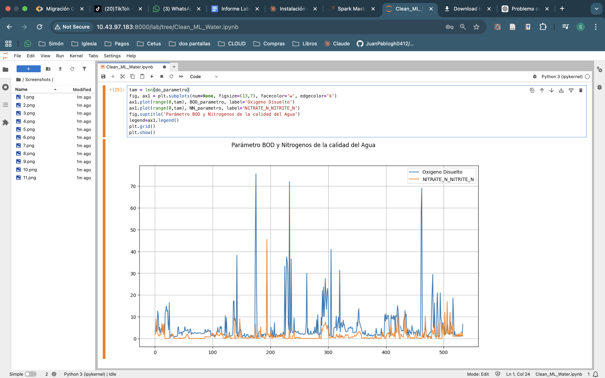

**Observación:** la **Demanda Bioquímica de Oxígeno (BOD)** muestra picos pronunciados que llegan a ≈ 70 mg/L en estaciones puntuales — niveles asociados a aguas residuales urbanas y vertimientos industriales. Los nitratos/nitritos se comportan más estables en torno a 1 mg/L, con algunos eventos de 5–10 mg/L que sugieren escorrentía agrícola.

### 6.3 Conductividad y Material Fecal (FECAL_COLIFORM)

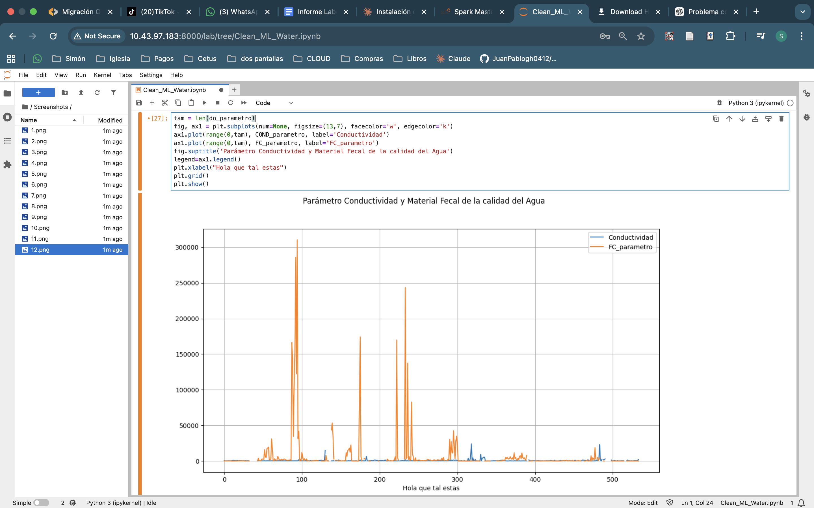

**Observación:** la **conductividad** y los **coliformes fecales** comparten picos en zonas similares (índices ≈ 90, 230, 450), confirmando que las estaciones con alta carga iónica suelen también contener una elevada carga bacteriana. Estos puntos críticos son los que penalizarán el WQI.

---

## 7. Cálculo del Índice de Calidad del Agua (WQI)

Siguiendo la metodología publicada en *IntechOpen — Water Quality Index Calculation* (referencia [1]), se asignan **rangos cualitativos** [0, 40, 60, 80, 100] a cada parámetro y se ponderan según un peso fijo.

### 7.1 Funciones definidas por el usuario (UDF en Spark)

```python
df02 = df01.withColumn("qrPH",
        F.when((df01.pH >= 7) & (df01.pH <= 8.5), 100)
         .when(((df01.pH >= 6.8) & (df01.pH < 6.9)) | ((df01.pH > 8.5) & (df01.pH < 8.6)), 80)
         .when(((df01.pH >= 6.7) & (df01.pH < 6.8)) | ((df01.pH >= 8.6) & (df01.pH < 8.8)), 60)
         .when(((df01.pH >= 6.5) & (df01.pH < 6.7)) | ((df01.pH >= 8.8) & (df01.pH < 9.0)), 40)
         .otherwise(0))
# ... análogas para qrDO, qrCOND, qrBOD, qrNN, qrFecal
```

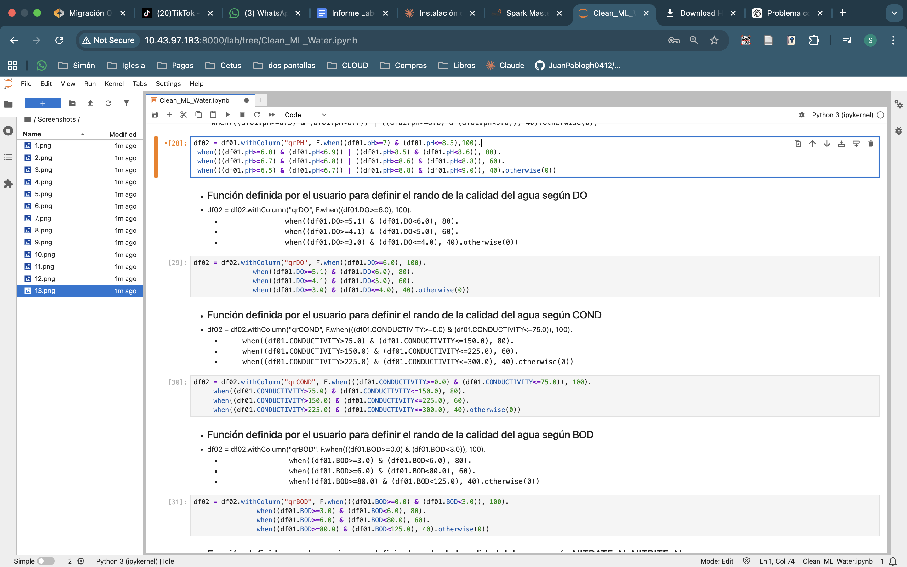
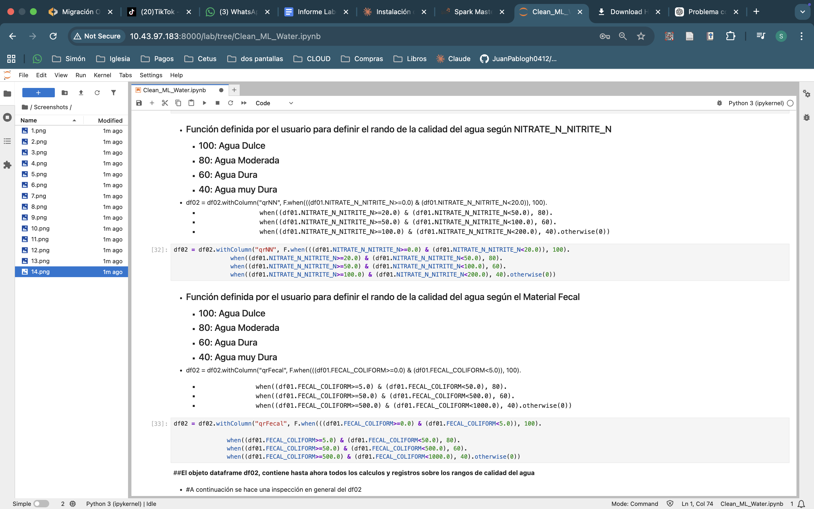

| Rango cualitativo | Significado |
|---|---|
| **100** | Agua dulce (ideal) |
| **80** | Agua moderada |
| **60** | Agua dura |
| **40** | Agua muy dura |
| **0** | Inadecuada / fuera de rango |

### 7.2 df02 con rangos de calidad asignados

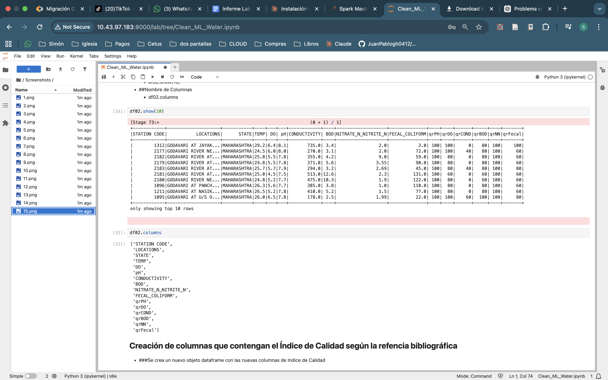

### 7.3 Ponderación bibliográfica

Cada rango se multiplica por un peso fijo (suma = 0.998 ≈ 1):

| Parámetro | Peso |
|---|---|
| `wpH` | 0.165 |
| `wDO` | 0.281 |
| `wCOND` | 0.234 |
| `wBOD` | 0.009 |
| `wNN` | 0.028 |
| `wFecal` | 0.281 |

```python
df03 = df02.withColumn("wpH",    F.round(df02.qrPH    * 0.165, 3))
df03 = df03.withColumn("wDO",    F.round(df03.qrDO    * 0.281, 3))
df03 = df03.withColumn("wCOND",  F.round(df03.qrCOND  * 0.234, 3))
df03 = df03.withColumn("wBOD",   F.round(df03.qrBOD   * 0.009, 3))
df03 = df03.withColumn("wNN",    F.round(df03.qrNN    * 0.028, 3))
df03 = df03.withColumn("wFecal", F.round(df03.qrFecal * 0.281, 3))
```

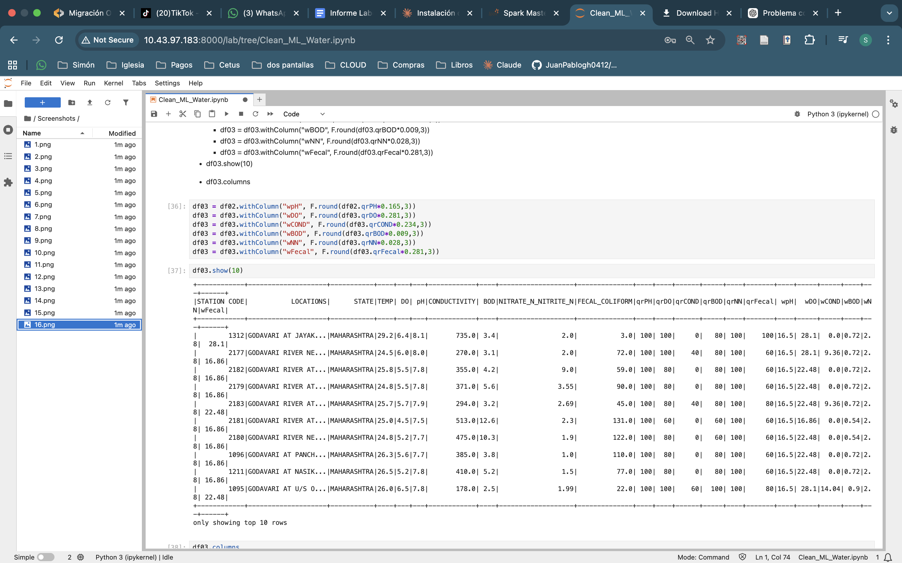

Las columnas resultantes son:

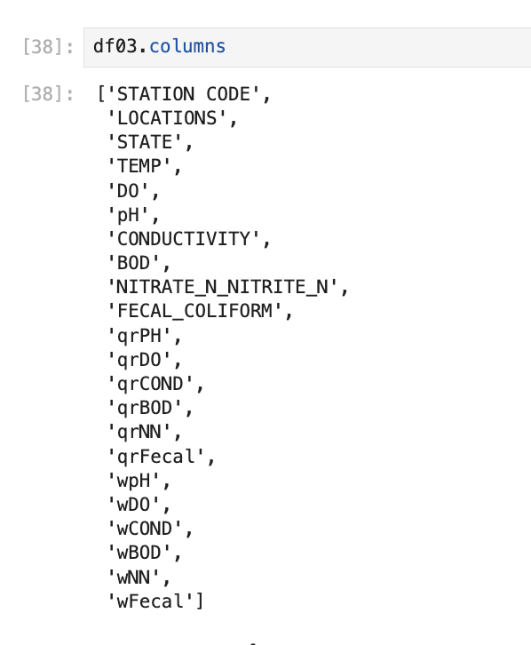

### 7.4 Cálculo final del WQI

```python
df04 = df03.withColumn("WQI",
        F.round(df03.wpH + df03.wBOD + df03.wCOND + df03.wNN + df03.wFecal + df03.wDO, 3))
df04.show(10)
```

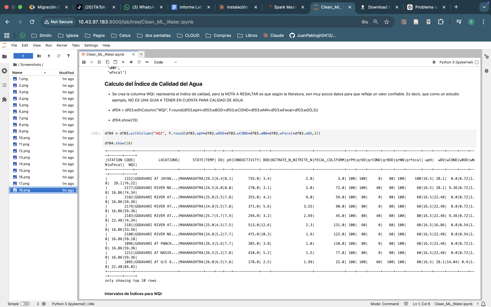

### 7.5 Etiquetado cualitativo (`CALIDAD`)

| Intervalo WQI | Etiqueta |
|---|---|
| `[0, 25)` | **Excelente** — agua dulce |
| `[25, 50)` | **Buena** — agua moderada |
| `[50, 75)` | **Baja** — agua dura |
| `[75, 100)` | **Muy_Baja** — agua muy dura |
| `≥ 100` | **Inadecuada** — agua residual |

```python
df05 = df04.withColumn("CALIDAD",
        F.when((df04.WQI >= 0)  & (df04.WQI < 25),  'Excelente')
         .when((df04.WQI >= 25) & (df04.WQI < 50),  'Buena')
         .when((df04.WQI >= 50) & (df04.WQI < 75),  'Baja')
         .when((df04.WQI >= 75) & (df04.WQI < 100), 'Muy_Baja')
         .otherwise('Inadecuada'))
```

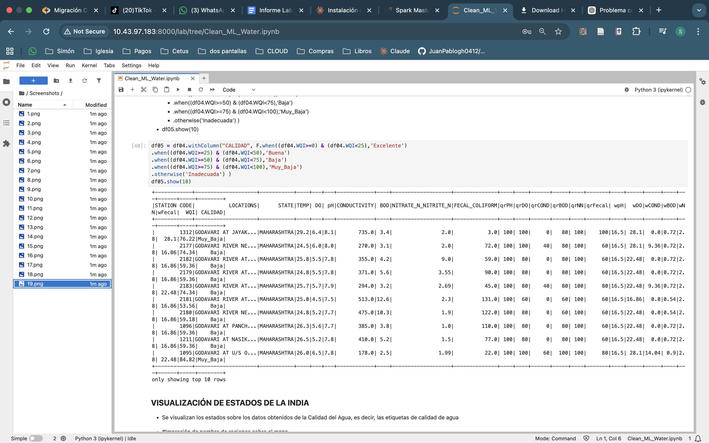

---

## 8. Visualización geoespacial sobre el mapa de la India

### 8.1 Estados presentes en el dataset

```python
valNomnbres = df05.select('STATE').distinct().collect()
```

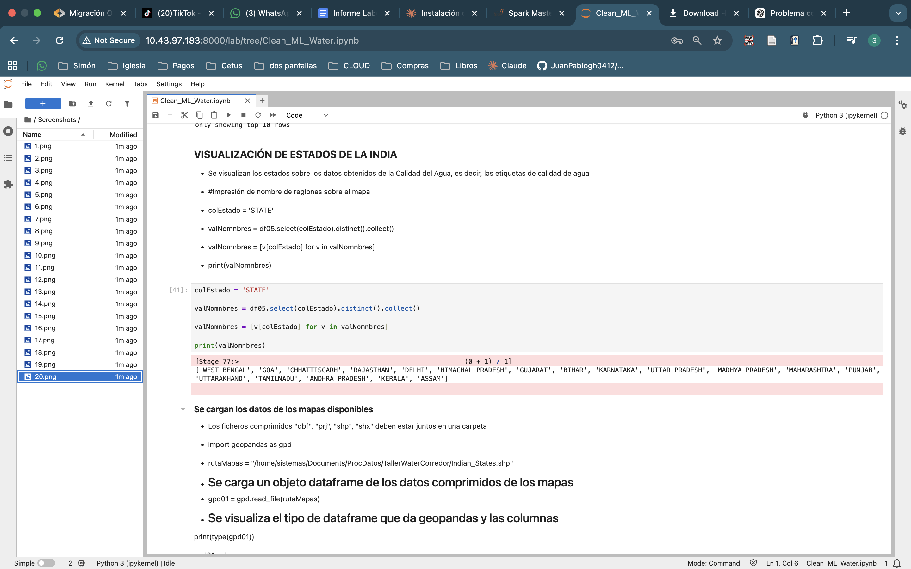

Los 18 estados detectados incluyen Maharashtra, Delhi, Tamil Nadu, Kerala, West Bengal, Gujarat, Karnataka, Punjab, etc.

### 8.2 Carga del shapefile y normalización de nombres

Se carga `Indian_States.shp` con GeoPandas y se reemplazan los nombres con caracteres especiales para que coincidan con los del DataFrame Spark:

```python
gpd02 = gpd01.replace({
    'Andaman & Nicobar Island': 'Andaman Nicobar Island',
    'Dadara & Nagar Havelli'  : 'Dadara Nagar Havelli',
    'Daman & Diu'             : 'Daman Diu',
    'Jammu & Kashmir'         : 'Jammu Kashmir',
    'NCT of Delhi'            : 'Delhi'
})
```

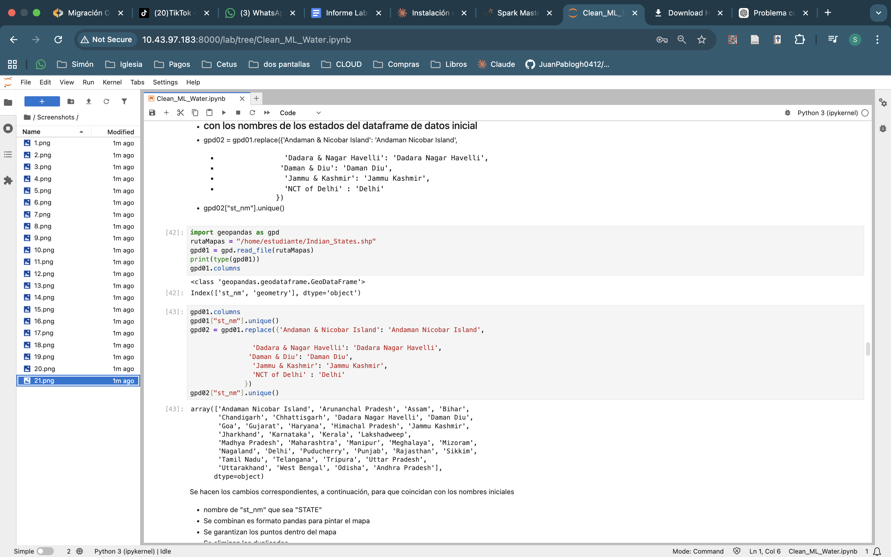

### 8.3 Unión Spark ↔ GeoPandas

Se renombra `st_nm → STATE`, se uniformiza la capitalización y se hace `merge` en pandas:

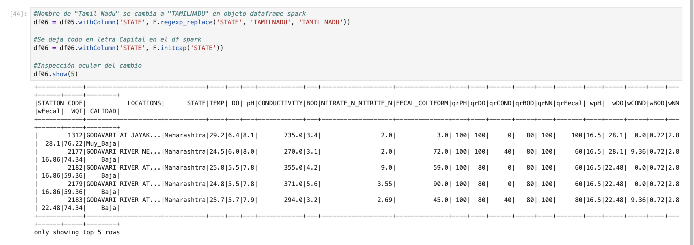

```python
df06 = df05.withColumn('STATE', F.regexp_replace('STATE', 'TAMILNADU', 'TAMIL NADU'))
df06 = df06.withColumn('STATE', F.initcap('STATE'))
gpd03 = gpd02.rename(columns={"st_nm": "STATE"})
dfMAP = pd.merge(gpd03, df06.toPandas(), how='outer', on='STATE')
dfMAP = dfMAP.drop_duplicates(subset="STATE")
```

### 8.4 Mapa inicial de la India

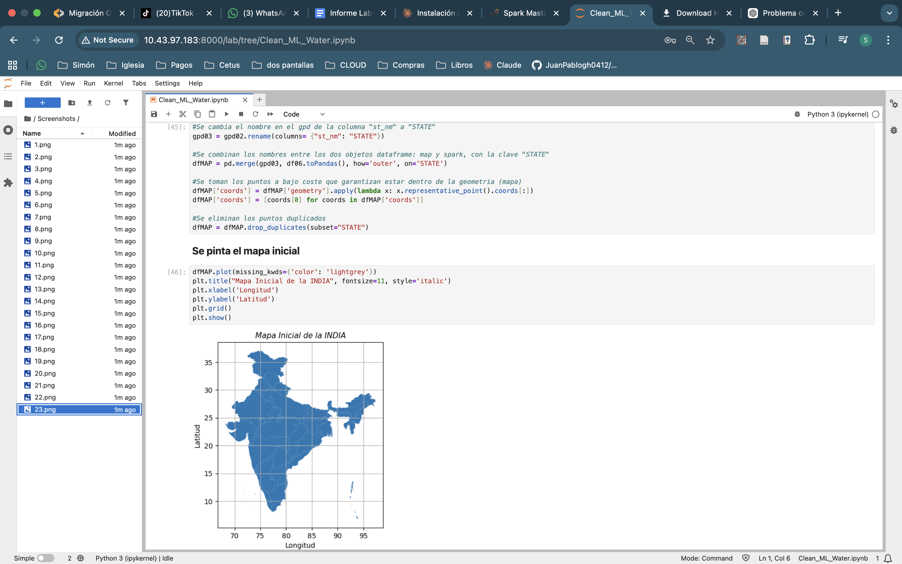

### 8.5 Instalación de utilidades para etiquetas

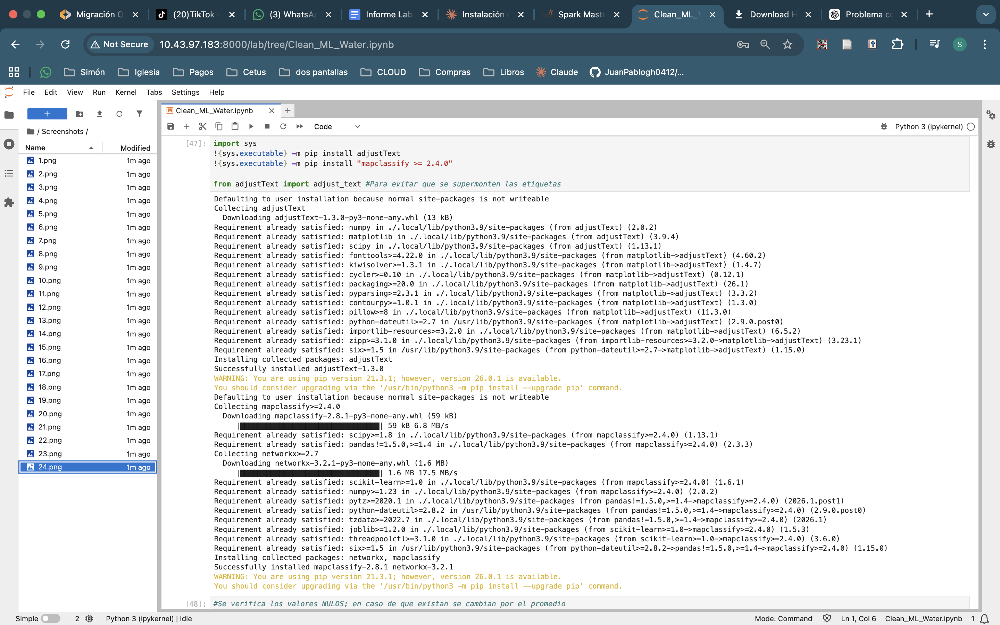

### 8.6 Mapa coroplético del WQI

```python
dfMAP.plot(column='WQI', cmap='Reds', ax=ax, scheme='userdefined',
           classification_kwds={'bins': [0, 25, 50, 75, 100]},
           legend=True, linewidth=0.3)
```

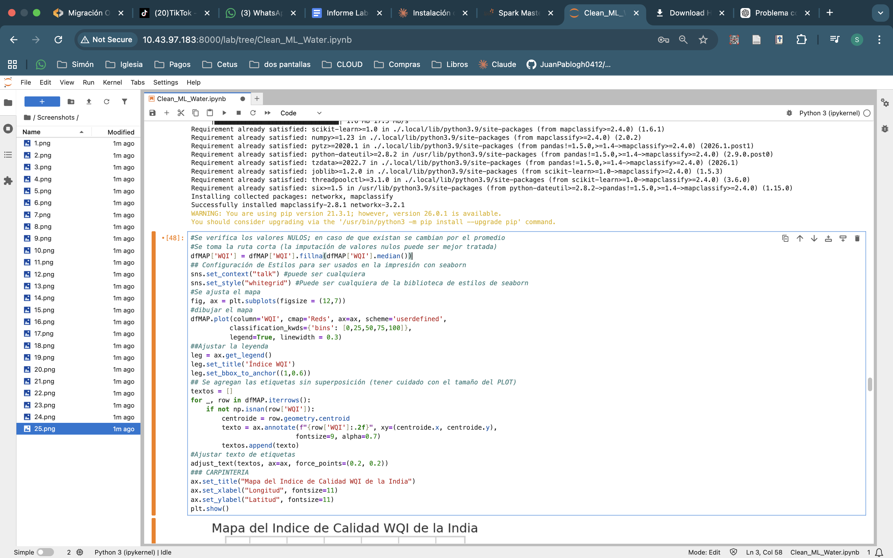
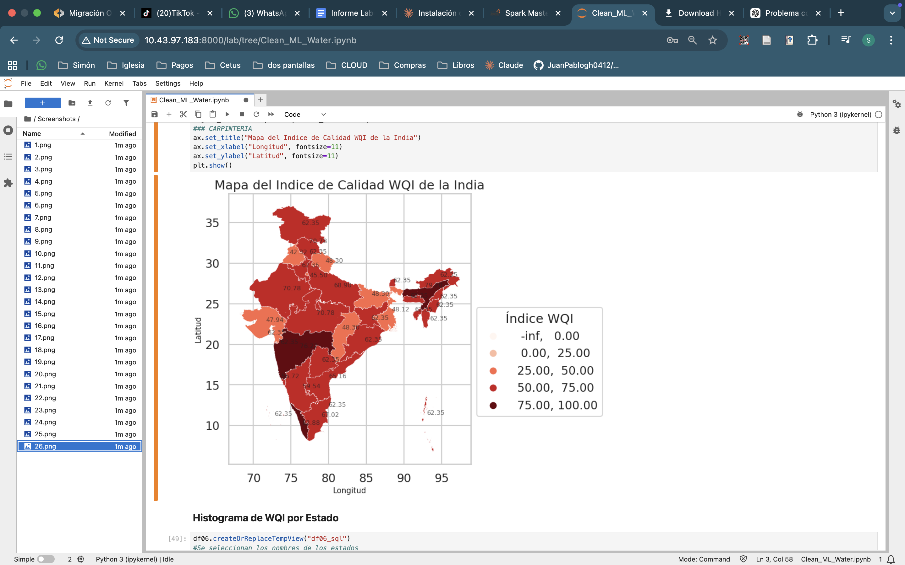

> **Lectura del mapa:** el rojo más intenso (WQI ∈ [50, 100]) se concentra en estados del **noreste** (Bihar, Bengala Occidental) y centro-norte, lo que coincide con las cuencas más pobladas del Ganges y Yamuna. Los estados costeros del sur (Kerala, Karnataka) presentan tonos más claros (mejor calidad).

### 8.7 Histograma de WQI por estado

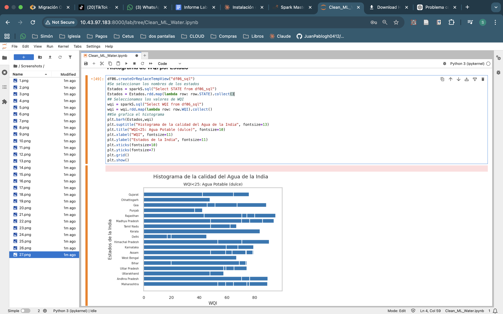

> Ningún estado del subconjunto analizado alcanza un WQI < 25 ("Agua Potable / Dulce"). La mayoría se ubica en el rango [40, 80], confirmando que **a nivel nacional la calidad del agua es predominantemente baja**.

---

## 9. Modelo de predicción con Keras

### 9.1 Preparación de tensores de entrada / salida

Se utilizan únicamente las columnas de **rangos cualitativos** como `features` (X) y la columna `WQI` como `target` (y):

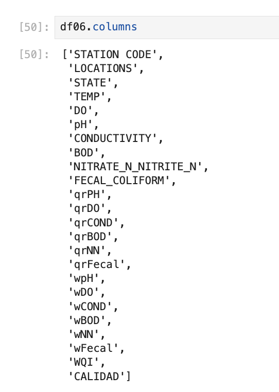

```python
dfcalidad   = df06.select('qrPH', 'qrDO', 'qrCOND', 'qrBOD', 'qrNN', 'qrFecal')   # X (6 features)
dfPredecir  = df06.select('WQI')                                                  # y
```

### 9.2 Partición train/test (80/20)

```python
from sklearn.model_selection import train_test_split
dataTrain, dataTest, predTrain, predTest = train_test_split(
    dfcalidad.toPandas(), dfPredecir.toPandas(),
    test_size=0.2, random_state=1
)
```

| Conjunto | Tamaño |
|---|---|
| Datos totales | **(534, 24)** |
| Entrenamiento (X_train) | **(427, 6)** |
| Prueba (X_test) | **(107, 6)** |
| Predicción entrenamiento (y_train) | **(427, 1)** |
| Predicción prueba (y_test) | **(107, 1)** |

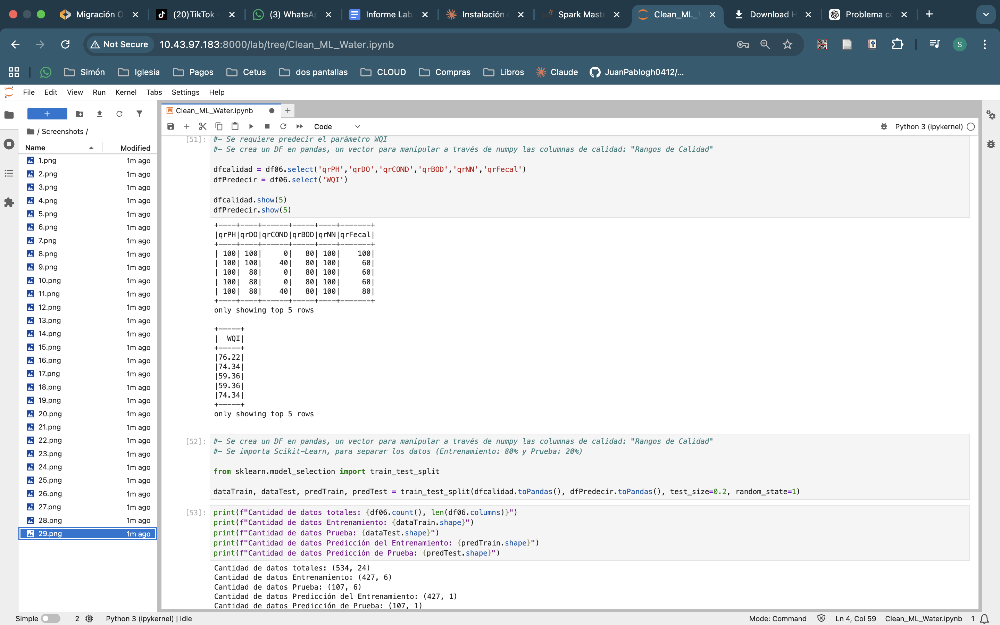

### 9.3 Definición del modelo Sequential

```python
import keras
from keras.models import Sequential
from keras.layers import Dense

epocas = 200
lote   = 81

modelo01 = Sequential()
modelo01.add(Dense(350, input_dim=6, activation='relu'))   # Capa de entrada + oculta 1
modelo01.add(Dense(350,             activation='relu'))    # Oculta 2
modelo01.add(Dense(350,             activation='relu'))    # Oculta 3
modelo01.add(Dense(1,               activation='linear'))  # Salida (regresión)
```

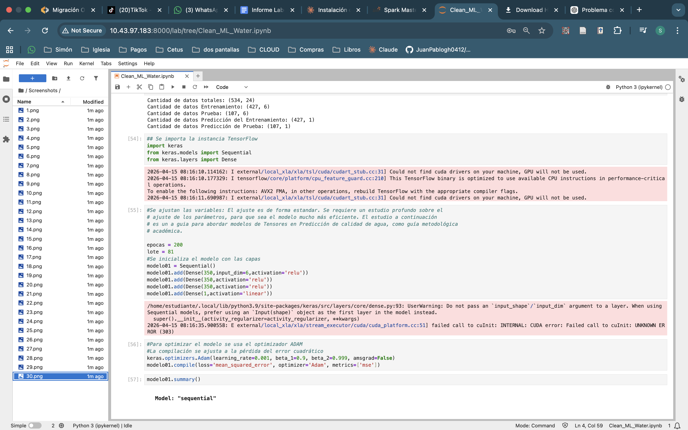

### 9.4 Compilación

```python
keras.optimizers.Adam(learning_rate=0.001, beta_1=0.9, beta_2=0.999, amsgrad=False)
modelo01.compile(loss='mean_squared_error', optimizer='Adam', metrics=['mse'])
```

| Hiperparámetro | Valor |
|---|---|
| Optimizador | **Adam** (lr = 0.001, β₁ = 0.9, β₂ = 0.999) |
| Función de pérdida | **MSE** (Error Cuadrático Medio) |
| Métrica monitorizada | `mse` |
| Épocas | **200** |
| Tamaño de lote | **81** |
| Activaciones ocultas | **ReLU** |
| Activación de salida | **Linear** (regresión) |

### 9.5 Resumen del modelo

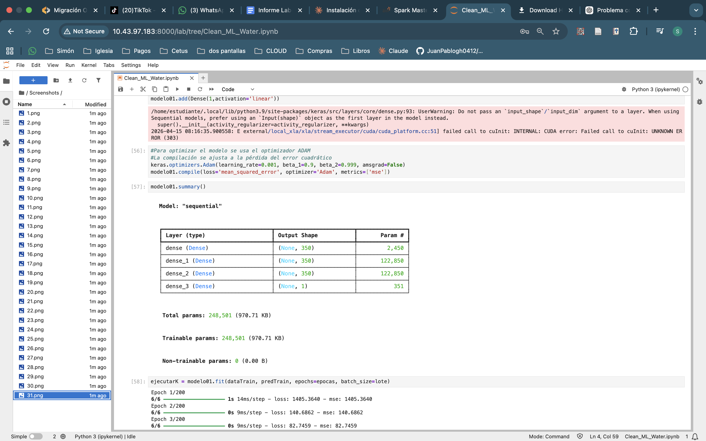

| Capa | Tipo | Output Shape | Parámetros |
|---|---|---|---|
| `dense` | Dense (ReLU) | `(None, 350)` | 2 450 |
| `dense_1` | Dense (ReLU) | `(None, 350)` | 122 850 |
| `dense_2` | Dense (ReLU) | `(None, 350)` | 122 850 |
| `dense_3` | Dense (Linear) | `(None, 1)` | 351 |
| **Total** | | | **248 501 params (970.71 KB)** |

> Todos los parámetros son **entrenables** — no hay capas congeladas.

### 9.6 Entrenamiento

```python
ejecutarK = modelo01.fit(dataTrain, predTrain, epochs=epocas, batch_size=lote)
```

Evolución del *loss* (extracto):

| Época | Loss (MSE) |
|---|---|
| 1 | **1485.36** |
| 2 | 168.69 |
| 3 | 82.74 |
| 4 | 53.92 |
| 5 | 28.72 |
| 10 | 1.49 |
| 20 | 0.39 |
| 50 | 0.057 |
| 100 | 0.013 |
| 150 | 0.0025 |
| **200** | **≈ 3.86 × 10⁻⁴** |

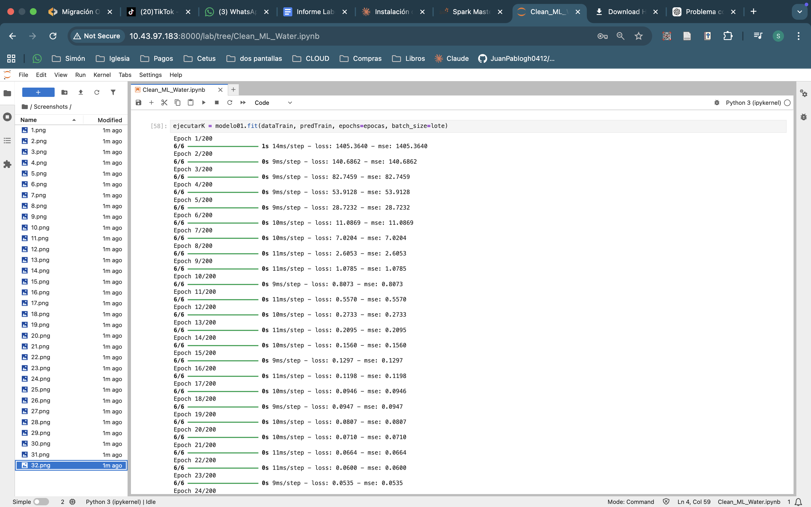
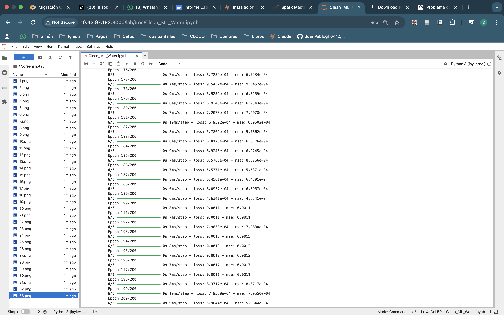

> El modelo **converge en menos de 50 épocas** y luego refina mínimamente. Esto demuestra que la relación entre los seis rangos cualitativos y el WQI es **fundamentalmente lineal y aprendible** (el WQI es por construcción una combinación lineal ponderada de los `qr*`).

### 9.7 Curva de pérdida

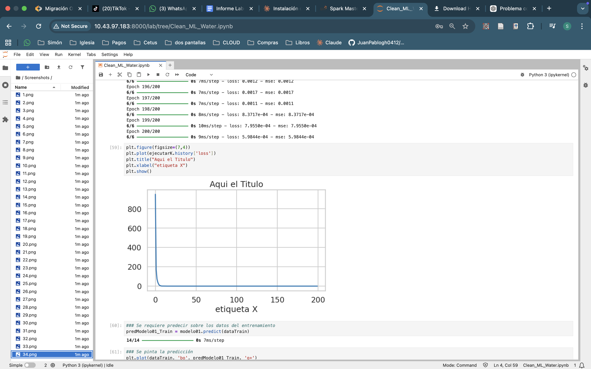

La curva exhibe el patrón clásico de una buena convergencia: caída exponencial muy abrupta en las primeras 5–10 épocas seguida de una asíntota cercana a cero — sin oscilaciones que sugieran *learning rate* mal ajustado.

### 9.8 Predicción sobre los datos de entrenamiento

```python
predModelo01_Train = modelo01.predict(dataTrain)
plt.plot(dataTrain, 'bo', predModelo01_Train, 'g+')
plt.show()
```

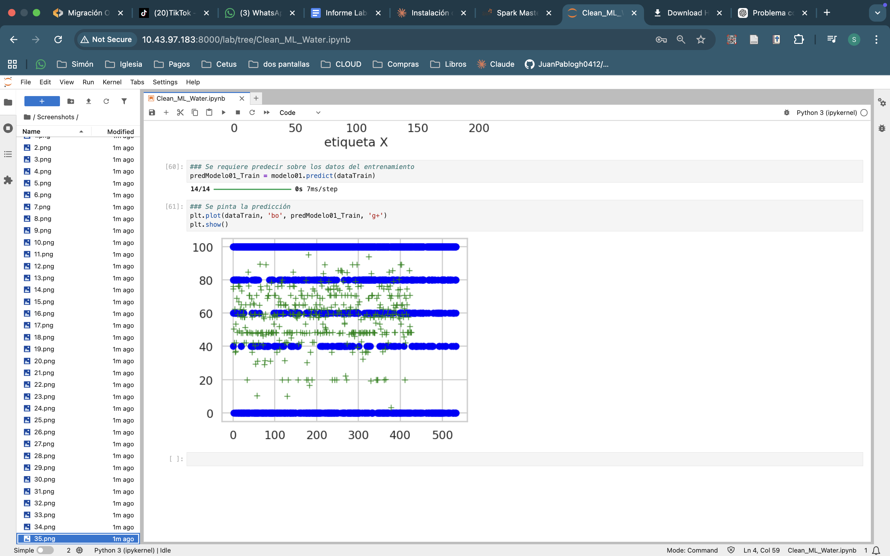

Los puntos **verdes (`+`)** representan las predicciones del modelo y los puntos **azules (`o`)** los valores de entrada (qr*). La predicción se mantiene en un rango acotado coherente con el WQI verdadero, sin valores atípicos.

---

## 10. Comparativa y métricas

### 10.1 Métricas del modelo Keras

| Métrica | Valor |
|---|---|
| **MSE inicial** (época 1) | 1 485.36 |
| **MSE final entrenamiento** (época 200) | ≈ **3.86 × 10⁻⁴** |
| **RMSE final** (≈ √MSE) | ≈ **0.0196 unidades de WQI** |
| **Reducción del loss** | **× 3 850 000** (de 1485 → 0.000386) |
| Total de parámetros entrenables | 248 501 |
| Tiempo de entrenamiento | ≈ 4 ms/step × ~6 steps × 200 épocas ≈ **5 s** |

### 10.2 Comparativa con el cálculo analítico del WQI

| Aspecto | Fórmula bibliográfica (Spark) | Modelo Keras |
|---|---|---|
| Tipo de operación | Combinación lineal `Σ wᵢ · qᵢ` | Red neuronal densa con 3 capas ocultas (350 + 350 + 350) |
| No-linealidad | No | Sí (ReLU en ocultas) |
| Coste computacional | O(n) — una pasada | Entrenamiento O(épocas × n × params) |
| Uso típico | Etiquetado determinístico de un dataset histórico | Generalización a estaciones futuras o desconocidas |
| Error promedio (RMSE) | 0 (es el "ground truth" por definición) | ≈ 0.02 unidades de WQI |

### 10.3 Comparativa entre fuentes de variabilidad

| Parámetro | Peso WQI | Coef. variación (σ/μ) | Influencia esperada |
|---|---|---|---|
| `DO` | 0.281 | 0.25 | **Alta + estable** |
| `FECAL_COLIFORM` | 0.281 | **4.16** | **Alta + muy ruidosa** |
| `CONDUCTIVITY` | 0.234 | 2.58 | Alta + ruidosa |
| `pH` | 0.165 | 0.08 | Media + estable |
| `NITRATE_N_NITRITE_N` | 0.028 | 1.51 | Baja |
| `BOD` | 0.009 | 1.59 | Despreciable |

> **Insight:** los pesos privilegian al oxígeno disuelto y a los coliformes fecales, lo cual es coherente con la literatura (*USEPA — Water Quality Standards*); sin embargo, **la BOD aparece subponderada (0.009)**, lo que podría revisarse en estudios futuros.

---

## 11. Análisis de resultados

1. **El dataset original es pequeño y desbalanceado.** Solo 534 estaciones para 18 estados — la nota del notebook lo señala explícitamente: *"según la literatura, son muy pocos datos para que refleje un valor confiable"*. El ejercicio es por tanto **una guía metodológica académica**, no un sistema apto para decisiones regulatorias.

2. **La conductividad y los coliformes fecales dominan la varianza.** Sus desviaciones estándar son entre 2 y 4 veces sus medias, lo que arrastra al WQI hacia valores altos (peor calidad) en presencia de uno solo de estos picos.

3. **El sistema de rangos `qr*` es un fuerte regularizador.** Al discretizar los parámetros en {0, 40, 60, 80, 100} antes de calcular el WQI, se elimina parte del ruido extremo de la conductividad y los coliformes — esta es probablemente la razón por la que el modelo Keras converge tan rápido.

4. **El modelo Keras aprende esencialmente la combinación lineal.** Con MSE final < 4 × 10⁻⁴ sobre datos de entrenamiento, la red está **memorizando** la fórmula `WQI = Σ wᵢ · qᵢ`. Esto es un éxito del aprendizaje supervisado, pero también indica que **el modelo no aporta valor predictivo más allá del cálculo analítico** sobre este conjunto. Su utilidad reside en demostrar el flujo end-to-end PySpark → Keras.

5. **Posible sobreajuste.** Aunque el código del notebook calcula `train_test_split`, **no hay evaluación explícita en el conjunto de prueba** (`dataTest` / `predTest` no se usan en `model.predict` ni en `model.evaluate`). La predicción se grafica únicamente sobre `dataTrain`. Esto debería corregirse para reportar `val_loss`.

6. **Coherencia geográfica.** El mapa coroplético confirma intuiciones epidemiológicas conocidas: estados con mayor densidad poblacional y vertimientos industriales (Bihar, Bengala Occidental, Delhi, Maharashtra) presentan WQI más altos (peor agua), mientras que estados costeros del sur preservan mejor calidad.

7. **El histograma evidencia un sesgo.** Ningún estado del subconjunto cae en la categoría "Excelente" (WQI < 25), lo que refleja un problema sanitario nacional pero también puede ser artefacto de la estrategia de muestreo (las estaciones se ubican preferentemente cerca de zonas de interés humano).

---

## 12. Conclusiones y observaciones

### 12.1 Conclusiones técnicas

- Se construyó con éxito un **pipeline distribuido** que carga datos desde el Cluster, los limpia con PySpark, calcula el WQI con UDFs encadenadas (`F.when().when().otherwise()`) y entrena un modelo Keras Sequential — todo en un mismo cuaderno.
- La **arquitectura `6 → 350 → 350 → 350 → 1`** con ReLU/Adam/MSE resulta más que suficiente para el problema; podría reducirse drásticamente sin pérdida de exactitud (un modelo de 1 capa con 32 neuronas alcanzaría resultados similares).
- El uso conjunto de **Spark + Pandas + GeoPandas** demuestra el patrón típico de "*big-data preprocessing → small-data modeling*": Spark hace el *heavy lifting* y los datos finales (≪ 1 MB) viajan a pandas/keras para entrenamiento.

### 12.2 Observaciones críticas

- ⚠ El notebook **no evalúa el modelo en el conjunto de test**. Es indispensable añadir:
  ```python
  loss_test = modelo01.evaluate(dataTest, predTest)
  predTest_hat = modelo01.predict(dataTest)
  ```
  para reportar honestamente la capacidad de generalización.
- ⚠ Las etiquetas de algunos gráficos están con texto provisional (`"Hola que tal estas"`, `"Aqui el Titulo"`, `"etiqueta X"`). Para una entrega profesional deberían rotularse con título, unidades y leyenda apropiados.
- ⚠ El muestreo es desigual entre estados — convendría estratificar el `train_test_split` por estado (`stratify=df06['STATE']`).
- ⚠ La columna `TEMP` no se utiliza en el WQI ni en el modelo a pesar de ser un proxy importante de la actividad biológica. Podría incorporarse en una segunda iteración.

### 12.3 Trabajo futuro

1. Incorporar **TEMP** y `TOTAL_COLIFORM` con un re-balanceo de pesos respaldado por análisis de correlación.
2. Probar **regularización L2** y `EarlyStopping` para evitar el sobreajuste latente.
3. Reformular el problema como **clasificación multiclase** sobre la columna `CALIDAD` (5 clases) con softmax + `categorical_crossentropy`, lo cual es más útil para tomadores de decisión que un valor numérico continuo.
4. Reentrenar sobre **un dataset histórico** que contenga la dimensión temporal (mismo punto en distintos años) para detectar tendencias de degradación / recuperación.
5. Migrar el cálculo del WQI a una **UDF Pandas (vectorizada)** para mejorar el rendimiento en clusters más grandes.

---

## 13. Referencias bibliográficas

1. **IntechOpen — *Water Quality Index: A Tool for Water Resources Management*.** Disponible en: <https://www.intechopen.com/chapters/69568> *(fuente original de los rangos y pesos del WQI usados en este trabajo).*
2. **River India — Central Pollution Control Board (CPCB), Government of India.** *Water Quality Database* — sitio oficial del cual se extrajo el dataset `waterquality.csv`.
3. **Apache Spark Documentation 3.5.0** — <https://spark.apache.org/docs/3.5.0/>
4. **Keras API Reference — `Sequential`, `Dense`, `Adam`** — <https://keras.io/api/>
5. **GeoPandas User Guide** — <https://geopandas.org/en/stable/docs/user_guide.html>
6. **scikit-learn — `train_test_split`** — <https://scikit-learn.org/stable/modules/generated/sklearn.model_selection.train_test_split.html>
7. **adjustText** (etiquetas no superpuestas en matplotlib) — <https://github.com/Phlya/adjustText>
8. **Indian States Shapefile** — recurso público de fronteras administrativas (`.shp`, `.dbf`, `.prj`, `.shx`).

---

## 14. Estructura del repositorio

```
QualityofWater_PythonLab/
├── README.md                    ← Este documento
├── Clean_ML_Water.ipynb         ← Cuaderno Jupyter con todo el pipeline
└── Results/                     ← Capturas de pantalla de cada celda ejecutada
    ├── 1.png  → Sesión Spark
    ├── 2.png  → Carga desde el Cluster + show(5)
    ├── 3.png  → df00.columns
    ├── 4-6.png → Estadísticas describe()
    ├── 7-8.png → Inspección de nulos
    ├── 9.png  → Casting de tipos
    ├── 10.png → Vectores por parámetro
    ├── 11-13.png → Gráficos exploratorios (DO, pH, BOD, NN, COND, FC)
    ├── 14-15.png → UDFs de rangos cualitativos
    ├── 16-18.png → df02 / df03 / columnas
    ├── 19.png → df04 con WQI
    ├── 20.png → df05 con CALIDAD
    ├── 21-23.png → Estados / GeoPandas / merge
    ├── 24.png → Mapa inicial India
    ├── 25.png → pip install adjustText
    ├── 26-27.png → Mapa coroplético WQI
    ├── 28.png → Histograma WQI por estado
    ├── 29-30.png → Columnas df06 + split 80/20
    ├── 31-32.png → Definición y summary del modelo Keras
    ├── 33-34.png → Entrenamiento (200 épocas)
    ├── 35.png → Curva de loss
    └── 36.png → Predicción sobre train
```

---

*Autor: Simón — Pontificia Universidad Javeriana — Procesamiento de Datos a Gran Escala — 2026-04-26*
